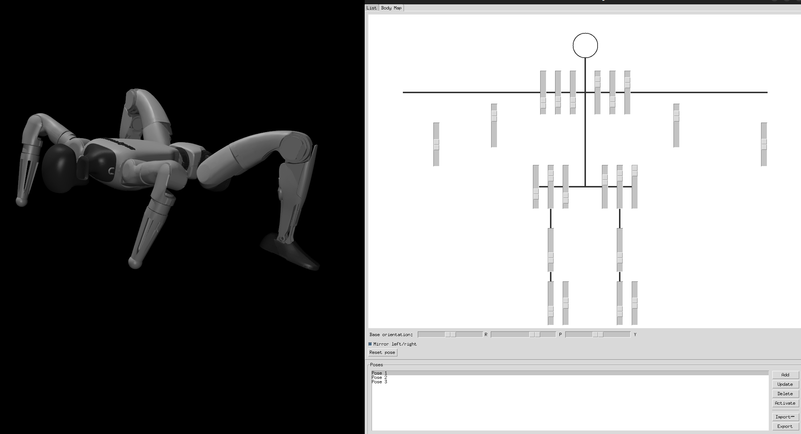

Interactive MuJoCo-based poser and crawl-gait tuner for the Unitree G1, powered by MINK IK. The entrypoint and focus of this repo is `main.py`.



### Quick start
```bash
pip3 install uv
uv sync
uv run main.py
```

### What `main.py` provides
- **Live IK gait tuning**: place hands/feet with simple 2D pads, set lift heights, duty/phase, and symmetry; MINK solves IK at ~200 Hz.
- **Camera controls**: azimuth, elevation, distance.
- **Import/Export**: save/load compact gait configs to `output/gait_*.json`.
- **Animation export**: write 3-cycle `gait_animation.v1` JSON (`output/animation_*.json`) with `qpos` frames and site positions for offline playback (e.g., Isaac Sim).
- **Model**: uses `g1_description/scene_g1_targets.xml`.

### Notes on other scripts
- Older scripts have been moved to `scripts/`. They have not been re-tested after the move and may be outdated/broken. Use at your own risk.
- Some of those scripts (e.g., real control) depend on Unitree SDK2 + CycloneDDS. If you explore them, you may need something like:
```bash
export CYCLONEDDS_HOME="$HOME/cyclonedds/install"
```

### Dev warning: Tkinter + MuJoCo threading
- Avoid `ttk.Entry`/`tk.Entry` with the MuJoCo viewer (can crash XCB). Use `ttk.Label` displays with variable traces instead.
- Defer `mujoco.*` calls that depend on the viewer until after the viewer is launched. `main.py` follows these patterns.
